# Rapport devoir 1 - IFT3911H26 - 2026.02.12

- Yamir Alejandro Poldo Silva 20240602  yamir.alejandro.poldo.silva@umontreal.ca (temps de travail 25 heures)
- nom2 matricule2
- nom3 matricule3

## Distribution des tâches 


## Modèle de conception du domaine: 

### Diagramme de classe conceptuel
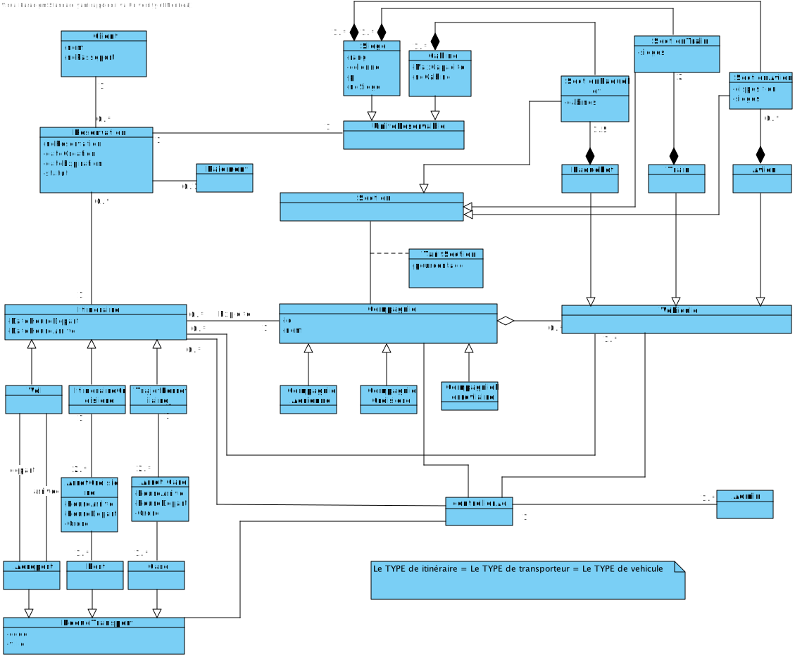
-- Justification ici

### Diagrammes de séquences système
**1 - Creer un Noeud de transport Aeroport/Port/Gare**

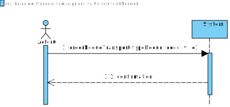

**2 - Modifier noeud de tranport**

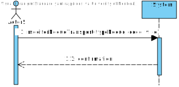

**3 - Supprimer noeud de transport**

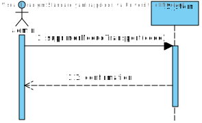

**4 - Creer compagnie** 

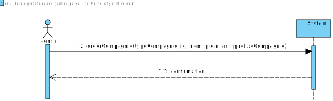

**5 - Modifier compagnie** 
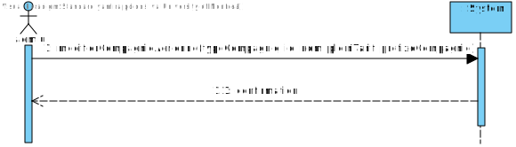

**6 - Supprimer compagnie**

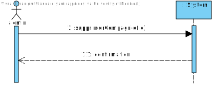 

**7 - Creer vol**  

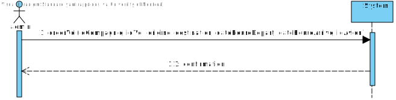

**8 - Modifier vol**

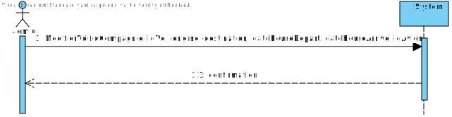

**9 - Supprimer itinéraire**

 

**10 - Creer section avion**

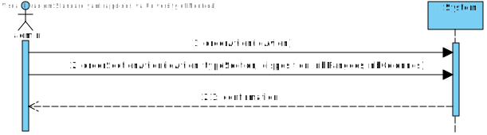

**11 - Assigner prix** 
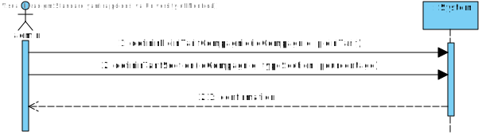

**12 - Consulter**

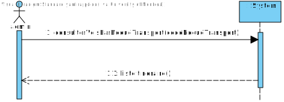 

**13 - Creer section paquebot** 

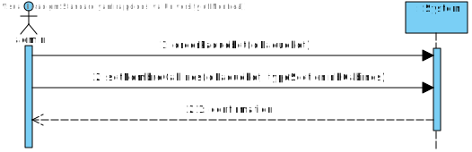

**14 - Creer Trajet de train**
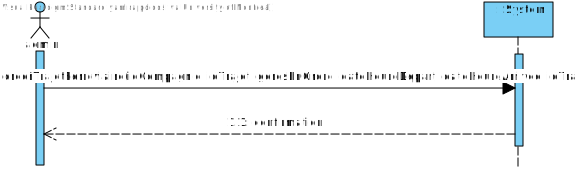 

**15 - Creer section Train** 
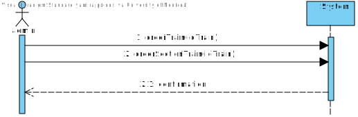


 

<!-- Justification ici (au besoin) -->

## Design logiciel 

### Diagramme de classe
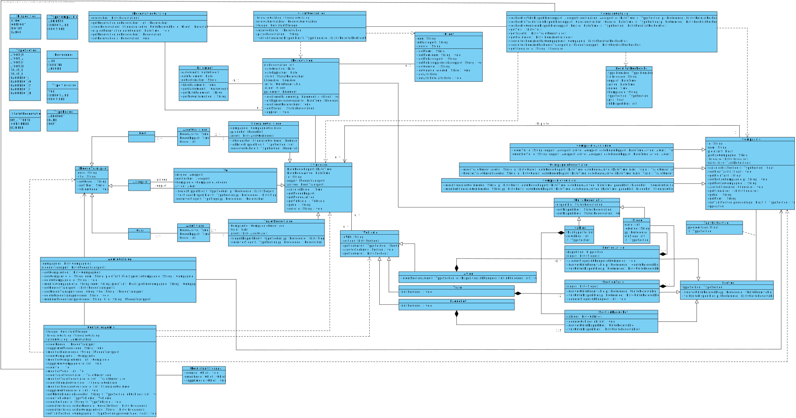
<!--  Justification GRASP ici + autres justifiation au besoin  -->

### Diagramme de paquets


<!-- Justifacation au besoin -->

### Diagrammes de collaboration 

#### Vérifier les vols/lignes/itinéraires

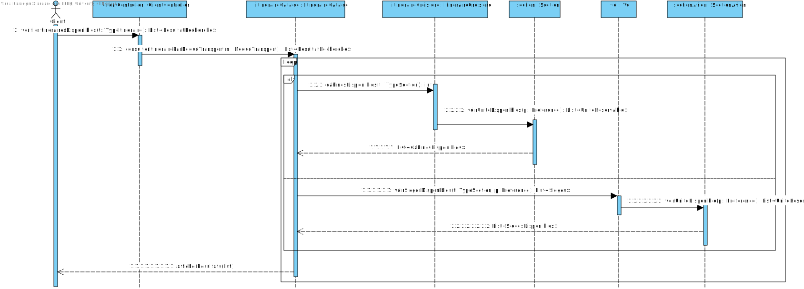

<!-- Justifacation au besoin -->

#### Réserver un siège

## 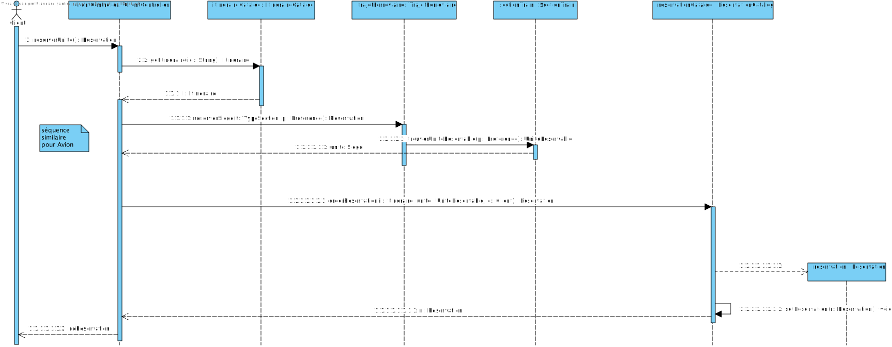 

<!-- Justification au besoin -->

#### Payer un siège

## 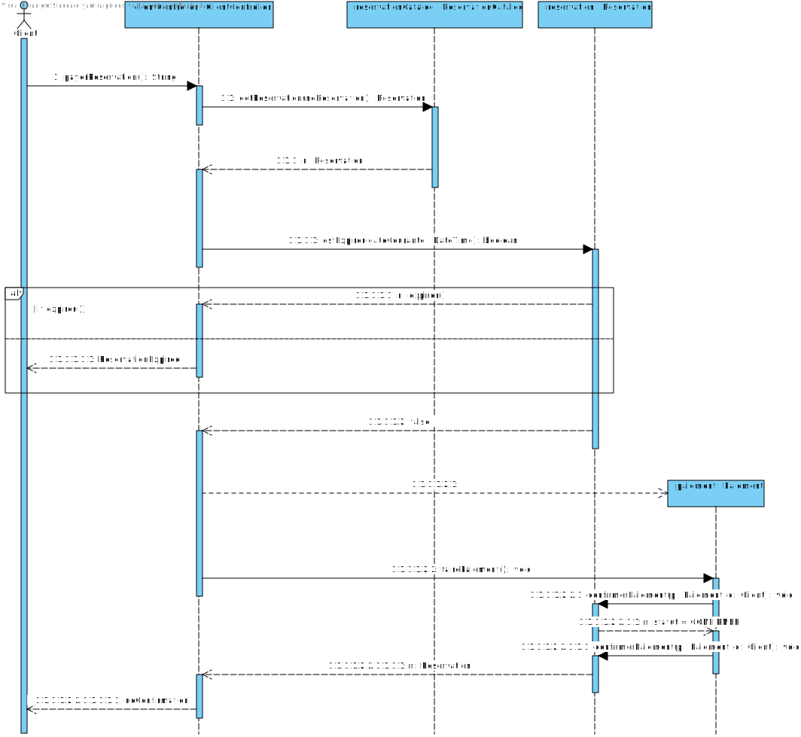 

### Contraites OCL
#### Un aéroport est identifié par trois lettres uniques à chaque aéroport 

La contrainte s'applique autant aux Aeroport, Port et Gare

```
context NoeudTransport
    inv: self.code.size() = 3
```

#### Chaque Aéroport, Port, Gare possède un code unique respectivement.

```
context Aéroport
    inv: Aéroport.allInstances()->isUnique(a | a.code)

context Port
    inv: Port.allInstances()->isUnique(p | p.code)

context Gare
    inv: Gare.allInstances()->isUnique(g |g.code)
```

#### La partie alphabétique de l'ID d'un vol est unique à chaque compagnie et la partie numérique est unique à chaque vol au sein de la même compagnie

La contrainte s'applique autant aux Aeroports, Port et Gare

```
context itineraire
    inv: 
        Vol.allInstances()
            -> select(v | v.compagnie = self.compagnie)
            -> isUnique(v | v.id.substring(3, v.id.size()) 
context itineraire
    inv: 
        Vol.allInstances() -> isUnique(v | v.compagnie.prefixeCompagnie) 
```

#### Le noeud de départ et d'arrivée d'un itineraire doit être différent

On note l'exception du voyage naval, où le port de départ et d'arrivé doit être le même

```
context itineraire
    inv: self.depart <> self.arrive

context ItinaireCroisiere
  inv: self.depart = self.arrive
```

#### Tous les sièges d'une même section ont le même prix ou Toutes les cabines d'une même section ont le même prix
```
context Section
    inv: self.tarifs->size() = 1
```

#### Un itinéraire ne peut pas durer plus de 21 jours

```
contexte ItineraireCroisiere
    -- 21 jours en secondes, assumant "Time" est en secondes
    def: duree:Integer = self.DateHeureArrive - self.DateHeureDepart
    inv: duree < 21 * 24 * 60 * 60; 
```

#### Un paquebot peut être assigné à plusieurs itinéraires tant qu'ils ne se chevauchent pas

```
context Paquebot
  inv:
    self.itineraires->forAll(i1, i2 | 
      i1 <> i2 implies
        ( i1.DateHeureArrive <= i2.DateHeureDepart
          or
          i2.DateHeureArrive <= i1.DateHeureDepart)
        )
```

#### Le client peut réserver un siège disponible dans un vol (trajet) donné 

```
context Vol::reserverSiege(t : TypeSection, p : Preference) : Reservation
  pre:
    self.avion.sections
    ->any(s | s.typeSection = t)
    .sieges
    ->exists(sg | sg.p = p and sg.disponible = true)
  post: 
    result <> null 
    and
    result.status = StatusReservation::EN_ATTENTE
    and
    result.unite.disponible = false

context TrajetFerroriaire::reserverSiege(t : TypeSection, p : Preference) : Reservation
  pre:
    self.train.sections
    ->any(s | s.typeSection = t)
    .sieges
    ->exists(sg | sg.p = p and sg.disponible = true)
  post: 
    result <> null 
    and
    result.status = StatusReservation::EN_ATTENTE
    and
    result.unite.disponible = false
```

#### Un siège réservé devient assigné à un passager une fois payé: le siège est donc confirmé

```
context Reservation::confirmerPaiement(p : Paiement,c : Client)
  pre:
    self.status = StatusReservation::EN_ATTENTE 
    and
    p <> null
    and
    c <> null
  post: 
    self.status = StatusReservation::CONFIRMEE 
    and
    self.unite <> null
    and
    self.paiement = p
    and 
    self.cleint = c

```

#### Le client peut réserver une cabine disponible pour un itinéraire donné

```
context ItineraireCroisiere::reserverCabine(t : TypeSection) : Reservation
  pre:
    self.paquebot.sections
    ->any(c | c.typeSection = t)
    .cabines
    ->exists(cg.disponible = true)
  post: 
    result <> null 
    and
    result.status = StatusReservation::EN_ATTENTE
    and
    result.unite.disponible = false
```