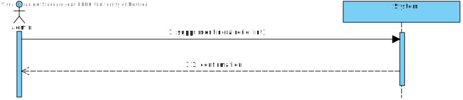

# Rapport DM1 - IFT3911 – Analyse et conception de logicel - 2026.02.12

- Yamir Alejandro Poldo Silva, 30h,  (...0602) -  yamir.alejandro.poldo.silva@umontreal.ca 
- Jean BRDKJI, 15h, (....0455) -  jean.brdkji@umontreal.ca 
- Arpad Botond Rigo, 19h, (...1538) - arpad.botond.rigo@umontreal.ca

## Distribution des tâches

Diagramme de classe conceptuel - Yamir

Diagrammes de séquence système - Arpad

Diagramme de classe - Yamir

Diagrammes de séquence ou de collaboration - Arpad

Diagramme de paquets - Jean 

Contraintes OCL - Jean 

Justifications - Arpad et Jean

### Scénarios

#### verifier_vols_lignes

Permet à un client de vérifier la dissponibilité de vols entre deux villes à une date donnée. Le client saisit la ville de départ, la ville d’arrivée et la date souhaitée. Le système affiche une liste de vols disponibles avec les horaires, les compagnies aériennes et les tarifs correspondants.

#### verifierItineraireCroisiere

Permet à un client de vérifier la disponibilité d’itinéraires de croisière entre deux ports à une date donnée. Le client saisit le port de départ, le port d’arrivée et la date souhaitée. Le système affiche une liste d’itinéraires de croisière disponibles avec les horaires, les compagnies de croisière et les tarifs correspondants.

#### éserver siège d'avion

Permet à un client de réserver un siège sur un vol spécifique. Le client sélectionne un vol, choisit une section (économique, affaires, première classe) et réserve un siège disponible. Le système confirme la réservation et fournit un confirmation.

#### Payer un siège réservé

Permet à un client de payer une réservation de siège. Le client sélectionne une réservation en attente de paiement, saisit les informations de paiement (carte de crédit, date d’expiration, code de sécurité) et confirme le paiement. Le système traite le paiement et met à jour le statut de la réservation.

## Modèle de conception du domaine: 
### Diagramme de classe conceptuel


### Diagrammes de séquences système
**1 - Creer un Noeud de transport Aeroport/Port/Gare**


**2 - Modifier noeud de tranport**


**3 - Supprimer noeud de transport**


**4 - Creer compagnie** 


**5 - Modifier compagnie** 


**6 - Supprimer compagnie**

 

**7 - Creer vol**  


**8 - Modifier vol**


**9 - Supprimer itinéraire**

 

**10 - Creer section avion**


**11 - Assigner prix** 


**12 - Consulter**

 

**13 - Creer section paquebot** 


**14 - Creer Trajet de train**

 

**15 - Creer section Train** 


<!-- Justification ici (au besoin) -->

## Design logiciel 

### Diagramme de classe

<!--  Justification GRASP ici + autres justifiation au besoin  -->

#### 1. Contrôleurs

Le système s'appuie sur deux contrôleurs distincts pour séparer les responsabilités et orchestrer les interactions entre l'interface et le système :

**ClientController** : Point d'entrée des cas d'utilisation clients (recherche de vols, trajets, croisières, réservation et paiement).

**ControllerAdmin** : Regroupe les opérations administratives (gestion nœuds, compagnies, vols, véhicules et sections).

Cette structure respecte le principe Contrôleur en agissant comme middleware, évitant ainsi d'alourdir les entités du domaine.

#### 2. Expert d'inforamation

Afin de maintenir une cohésion forte, la logique métier est confiée aux classes qui détiennent l'information nécessaire :

**Itinéraire** : En possédant les dates de départ et d'arrivée, elle est l'expert naturel pour implémenter calculerDuree().

**Réservation** : Détient les dates de création, d'expiration et le statut. Elle gère donc son propre cycle de vie (estExpirer(), expirer()).

**Paiement** : Regroupe les détails de transaction (carte, confirmation) et est responsable de l'opération fairePaiement(), évitant ainsi de surcharger les contrôleurs ou la classe Réservation.

#### 3. Créateur

La responsabilité de l'instanciation est confiée aux classes qui agrègent ou utilisent étroitement les objets créés :

**ReservationCatalog** : Responsable de creerReservation(), car il centralise et gère l'ensemble des instances de réservations.

**Compagnies de transport** : Les classes CompagnieAerienne, CompagnieFerroviaire et CompagnieCroisiere créent leurs offres respectives (vols, trajets, itinéraires), car elles possèdent les règles métier et les données sources nécessaires.


#### 4. Fabrication Pure 

Pour maintenir une cohésion forte et éviter de surcharger les entités métier, des classes utilitaires ont été introduites :

  **ItineraireCatalog, ReservationCatalog et AdminCatalog** : Ces classes agissent comme des Fabrications Pures en regroupant les méthodes de gestion et de recherche.

Cela évite d'ajouter des responsabilités de "gestion de collection" ou de "persistance" directement dans les classes Itineraire, Compagnie ou Reservation, gardant ainsi la logique métier simple. 

#### 5. Bas Couplage 

La classe PersistantStorage centralise l’accès à la persistance des données.
Cela réduit le couplage entre les entités du domaine (Reservation, Client, Itineraire) et les mécanismes de stockage, conformément au principe Bas Couplage.

#### 6. Haute Cohésion — Vehicule

Vehicule contient une collection de Section et offre des méthodes comme ajouterSection() et getSections().
Cette responsabilité est fortement cohésive : un véhicule est naturellement responsable de la gestion de ses sections.

#### 7. Indirection — ResultatRecherche

La classe ResultatRecherche agit comme une Indirection en regroupant uniquement les données essentielles à l'affichage, telles que les dates, prix et disponibilités. En servant d'intermédiaire entre la présentation et les objets métier, elle réduit le couplage global et permet de modifier la logique interne du système sans impacter l'interface utilisateur.

### Diagramme de paquets


<!-- Justifacation au besoin -->

### Diagrammes de collaboration 

#### Vérifier les vols/lignes/itinéraires


<!-- Justifacation au besoin -->

#### Réserver un siège

##  

<!-- Justification au besoin -->

#### Payer un siège

##  

### Contraites OCL
#### Un aéroport est identifié par trois lettres uniques à chaque aéroport 

La contrainte s'applique autant aux Aeroport, Port et Gare

```
context NoeudTransport
    inv: self.code.size() = 3
```

#### Chaque Aéroport, Port, Gare possède un code unique respectivement.

```
context Aéroport
    inv: Aéroport.allInstances()->isUnique(a | a.code)

context Port
    inv: Port.allInstances()->isUnique(p | p.code)

context Gare
    inv: Gare.allInstances()->isUnique(g |g.code)
```

#### La partie alphabétique de l'ID d'un vol est unique à chaque compagnie et la partie numérique est unique à chaque vol au sein de la même compagnie

La contrainte s'applique autant aux Aeroports, Port et Gare

```
context itineraire
    inv: 
        Vol.allInstances()
            -> select(v | v.compagnie = self.compagnie)
            -> isUnique(v | v.id.substring(3, v.id.size()) 
context itineraire
    inv: 
        Vol.allInstances() -> isUnique(v | v.compagnie.prefixeCompagnie) 
```

#### Le noeud de départ et d'arrivée d'un itineraire doit être différent

On note l'exception du voyage naval, où le port de départ et d'arrivé doit être le même

```
context itineraire
    inv: self.depart <> self.arrive

context ItinaireCroisiere
  inv: self.depart = self.arrive
```

#### Tous les sièges d'une même section ont le même prix ou Toutes les cabines d'une même section ont le même prix
```
context Section
    inv: self.tarifs->size() = 1
```

#### Un itinéraire ne peut pas durer plus de 21 jours

```
contexte ItineraireCroisiere
    -- 21 jours en secondes, assumant "Time" est en secondes
    def: duree:Integer = self.DateHeureArrive - self.DateHeureDepart
    inv: duree < 21 * 24 * 60 * 60; 
```

#### Un paquebot peut être assigné à plusieurs itinéraires tant qu'ils ne se chevauchent pas

```
context Paquebot
  inv:
    self.itineraires->forAll(i1, i2 | 
      i1 <> i2 implies
        ( i1.DateHeureArrive <= i2.DateHeureDepart
          or
          i2.DateHeureArrive <= i1.DateHeureDepart)
        )
```

#### Le client peut réserver un siège disponible dans un vol (trajet) donné 

```
context Vol::reserverSiege(t : TypeSection, p : Preference) : Reservation
  pre:
    self.avion.sections
    ->any(s | s.typeSection = t)
    .sieges
    ->exists(sg | sg.p = p and sg.disponible = true)
  post: 
    result <> null 
    and
    result.status = StatusReservation::EN_ATTENTE
    and
    result.unite.disponible = false

context TrajetFerroriaire::reserverSiege(t : TypeSection, p : Preference) : Reservation
  pre:
    self.train.sections
    ->any(s | s.typeSection = t)
    .sieges
    ->exists(sg | sg.p = p and sg.disponible = true)
  post: 
    result <> null 
    and
    result.status = StatusReservation::EN_ATTENTE
    and
    result.unite.disponible = false
```

#### Un siège réservé devient assigné à un passager une fois payé: le siège est donc confirmé

```
context Reservation::confirmerPaiement(p : Paiement,c : Client)
  pre:
    self.status = StatusReservation::EN_ATTENTE 
    and
    p <> null
    and
    c <> null
  post: 
    self.status = StatusReservation::CONFIRMEE 
    and
    self.unite <> null
    and
    self.paiement = p
    and 
    self.cleint = c

```

#### Le client peut réserver une cabine disponible pour un itinéraire donné

```
context ItineraireCroisiere::reserverCabine(t : TypeSection) : Reservation
  pre:
    self.paquebot.sections
    ->any(c | c.typeSection = t)
    .cabines
    ->exists(cg.disponible = true)
  post: 
    result <> null 
    and
    result.status = StatusReservation::EN_ATTENTE
    and
    result.unite.disponible = false
```